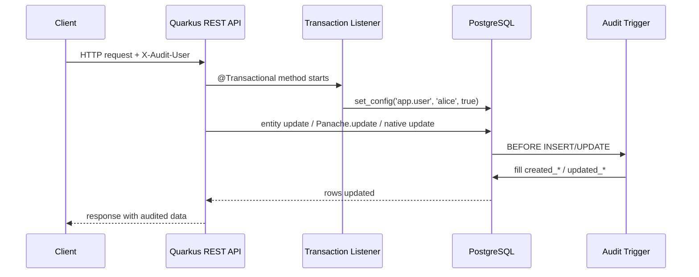

# Quarkus + Panache Audit Trigger Demo


A production-style demo showing how to make audit columns **work consistently** with:

- managed entity updates
- `Panache.update(...)` bulk updates
- native SQL updates
- any other client that writes to the same PostgreSQL tables

This repository exists because `@PreUpdate`, `@EntityListeners`, and similar JPA/Hibernate mechanisms **do not fire** when data is changed through a bulk `Query` update. In other words: the classic ORM-based audit pattern breaks the moment a team starts using mutation queries for performance or convenience.

This demo uses a safer approach:

1. **The application writes the current user into a PostgreSQL transaction-local setting**
2. **A database trigger reads that value**
3. **The database owns `created_*` / `updated_*` fields**

That makes auditing transparent for developers and consistent across write paths.

---

## The problem

With Quarkus + Panache, this works for managed entities:

```java
product.name = "new-name";
```

But this does **not** execute entity lifecycle callbacks:

```java
productRepository.update("name = ?1 where id = ?2", "new-name", id);
```

So if your auditing depends on `@PreUpdate`, `@EntityListeners`, or `@UpdateTimestamp`, you get inconsistent behavior:

- managed entity path → audit fields updated
- bulk update path → audit fields missing or stale

That inconsistency is exactly what this demo solves.

---

## The solution in one sentence

**Put audit truth in PostgreSQL, not in ORM callbacks.**

The Java side only needs to set a transaction-local variable:

```sql
select set_config('app.user', ?, true)
```

Then the trigger can do the rest:

- `created_at`
- `created_by`
- `updated_at`
- `updated_by`

Because the trigger runs in the database, the audit policy applies equally to:

- JPA dirty checking
- `Panache.update(...)`
- native SQL updates
- scripts / DB tools / other services

---

## Architecture



A polished SVG version also lives in [`docs/audit-flow.svg`](docs/audit-flow.svg).

---

## Why this repo is useful

This repo is intentionally designed as a **public GitHub reference implementation**, not a toy snippet.

It shows:

- a reusable PostgreSQL trigger function
- transparent transaction-scoped user propagation in Quarkus
- clean separation between audit infrastructure and domain code
- REST endpoints that demonstrate three write paths
- tests that verify the audit behavior end-to-end

So instead of debating "should we remember to update `updated_by` in every query?", you can point teammates to a working repo.

---

## Stack

- Java 21
- Quarkus 3.32.x
- Hibernate ORM with Panache
- PostgreSQL
- Flyway
- Quarkus REST + Jackson
- SmallRye OpenAPI
- Spotless (Palantir Java Format)

---

## Project layout

```text
src
├── main
│   ├── java/io/github/nelsoncc/auditdemo
│   │   ├── audit
│   │   │   ├── AuditRequestContext.java
│   │   │   ├── AuditUserCaptureFilter.java
│   │   │   ├── AuditUserProvider.java
│   │   │   └── PostgresAuditTransactionListener.java
│   │   └── product
│   │       ├── dto
│   │       ├── Product.java
│   │       ├── ProductMapper.java
│   │       ├── ProductRepository.java
│   │       ├── ProductResource.java
│   │       └── ProductService.java
│   └── resources
│       ├── application.properties
│       └── db/migration/V1__create_audit_demo_schema.sql
└── test
    └── java/io/github/nelsoncc/auditdemo/product/ProductResourceTest.java
```

---

## Run locally

### Prerequisites

- Java 21+
- Docker

### Start in dev mode

```bash
./mvnw quarkus:dev
```

Quarkus Dev Services will start PostgreSQL automatically.

Useful URLs:

- API: `http://localhost:8080`
- Swagger UI: `http://localhost:8080/q/swagger-ui`
- OpenAPI: `http://localhost:8080/q/openapi`

---

## Demo flow

### 1) Create products

```bash
curl -s -X POST http://localhost:8080/products \
  -H "Content-Type: application/json" \
  -H "X-Audit-User: alice" \
  -d '{"name":"tmp-alpha"}' | jq

curl -s -X POST http://localhost:8080/products \
  -H "Content-Type: application/json" \
  -H "X-Audit-User: alice" \
  -d '{"name":"tmp-beta"}' | jq
```

### 2) Managed entity update

```bash
curl -s -X PUT http://localhost:8080/products/1/rename-managed \
  -H "Content-Type: application/json" \
  -H "X-Audit-User: bob" \
  -d '{"newName":"tmp-alpha-renamed"}' | jq
```

### 3) Bulk update through Panache

```bash
curl -s -X POST http://localhost:8080/products/archive/panache \
  -H "Content-Type: application/json" \
  -H "X-Audit-User: carol" \
  -d '{"prefix":"tmp-"}' | jq
```

### 4) Bulk update through native SQL

```bash
curl -s -X POST http://localhost:8080/products/unarchive/native \
  -H "Content-Type: application/json" \
  -H "X-Audit-User: dave" \
  -d '{"prefix":"tmp-"}' | jq
```

### 5) Inspect rows

```bash
curl -s http://localhost:8080/products | jq
```

You should see:

- `created_by` set on insert
- `updated_by` changing per request user
- audit columns changing even for bulk updates

---

## Endpoints

| Method | Path | Purpose |
|---|---|---|
| `POST` | `/products` | Create a product |
| `GET` | `/products` | List all products |
| `GET` | `/products/{id}` | Fetch a single product |
| `PUT` | `/products/{id}/rename-managed` | Update through managed entity dirty checking |
| `POST` | `/products/archive/panache` | Bulk update via `Panache.update(...)` |
| `POST` | `/products/unarchive/native` | Bulk update via native SQL |

---

## Key design decisions

### 1) Audit fields are database-owned

The entity maps audit columns as:

```java
@Column(insertable = false, updatable = false)
```

That avoids split-brain ownership between Hibernate and PostgreSQL.

### 2) The trigger is authoritative

The trigger **always overwrites** audit columns — application code cannot bypass the audit policy, not even with raw SQL. This is intentional: audit integrity should not depend on callers remembering to do the right thing.

### 3) Audit user is propagated once per transaction

The transaction listener sets `app.user` at transaction start. Developers do **not** need to remember to patch every update query manually.

### 4) The trigger is reusable

The same trigger function can be attached to any table that follows the same audit column convention.

### 5) Bulk updates clear the persistence context

After HQL/native bulk updates, the service clears the persistence context before re-reading rows. This avoids returning stale in-memory state.

---

## PostgreSQL trigger strategy

This repo uses a single trigger function for both insert and update:

- On `INSERT`
  - set `created_at` and `created_by`
  - initialize `updated_at` and `updated_by`

- On `UPDATE`
  - refresh `updated_at`
  - refresh `updated_by`

This gives a complete audit story without scattering timestamp/user code across services.

---

## Why not use ORM callbacks only?

Because ORM callbacks are not enough once a codebase starts using query-based bulk updates.

That means solutions such as:

- `@PreUpdate`
- `@EntityListeners`
- `@UpdateTimestamp`

are useful for managed entities, but **not sufficient as the global audit strategy**.

If you want a team-safe, query-safe, tool-safe solution, the database is the right boundary.

---

## Production notes

This is a demo, but the pattern is production-worthy.

Recommended hardening steps:

- read the current user from real authentication instead of only `X-Audit-User`
- propagate technical users for schedulers / batch jobs
- add the same trigger to all audited tables
- document the audit column convention clearly
- avoid letting application code write audit columns directly
- monitor long-running bulk updates as normal database operations

---

## Test

```bash
./mvnw verify
```

The tests are **independent of each other** — JUnit 5 does not guarantee execution order, and these tests do not depend on any shared state. Each test creates its own data.

The tests exercise:

| Test | What it proves |
|---|---|
| `shouldCreateProductWithAuditColumnsFilledByTrigger` | INSERT trigger fills all four audit columns |
| `shouldUpdateAuditColumnsForManagedAndBulkPaths` | `updatedBy` changes correctly across managed entity update, Panache bulk update, and native SQL update |
| `shouldFallbackToSystemWhenNoAuditHeaderIsProvided` | Without `X-Audit-User`, the trigger defaults to `system` |

---

## What to copy into a real project

The minimum reusable pieces are:

1. the trigger function
2. the table triggers
3. the transaction listener that sets `app.user`
4. a provider that resolves the current user
5. read-only audit field mapping in entities

Everything else in this repository is there to make the idea easy to run, inspect, and explain.

---

## Further reading

Official docs that support the core idea behind this repository:

- Jakarta Persistence `@PreUpdate`: https://jakarta.ee/specifications/persistence/4.0/apidocs/jakarta.persistence/jakarta/persistence/preupdate
- Quarkus transactions and `@Initialized(TransactionScoped.class)`: https://quarkus.io/guides/transaction
- Hibernate `Session#doWork(...)`: https://docs.hibernate.org/orm/6.5/javadocs/org/hibernate/Session.html
- PostgreSQL `set_config` / `current_setting`: https://www.postgresql.org/docs/current/functions-admin.html

These are the four pillars of the pattern:
JPA explains the limitation, Quarkus provides the transaction lifecycle hook, Hibernate provides safe access to the JDBC connection, and PostgreSQL stores the audit truth.

---

## License

MIT
